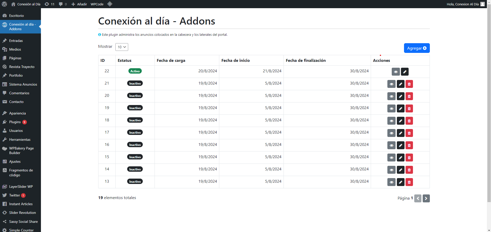
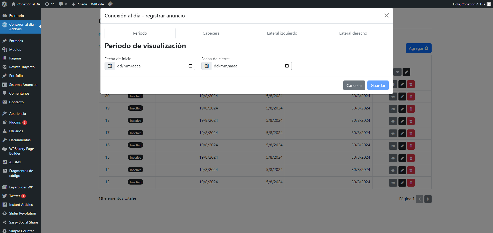
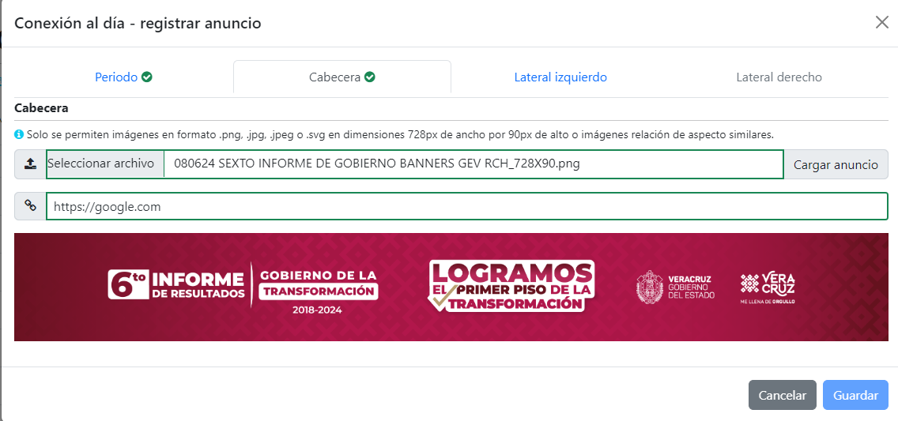
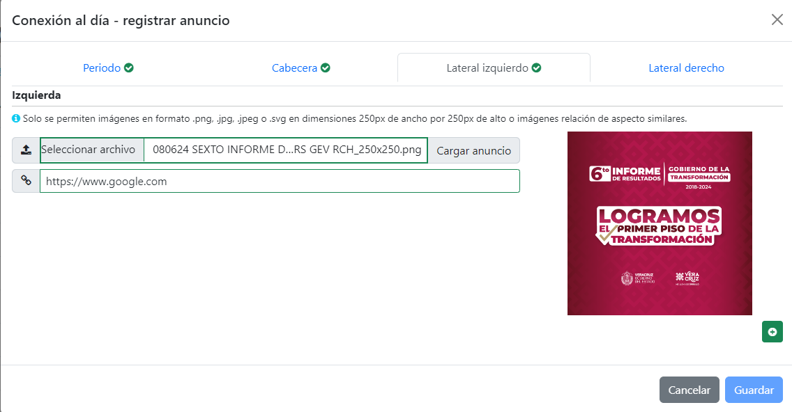
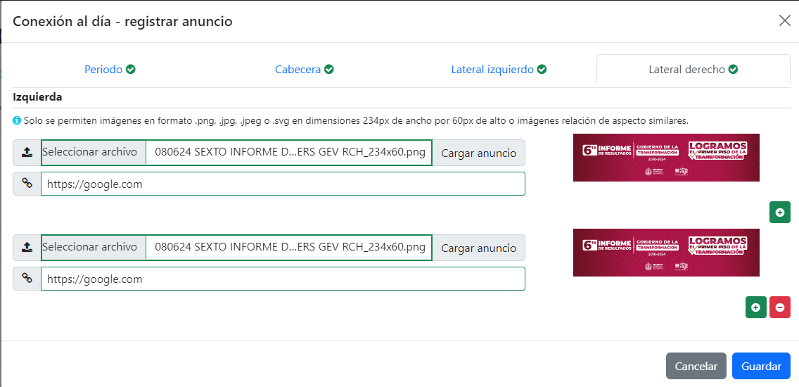
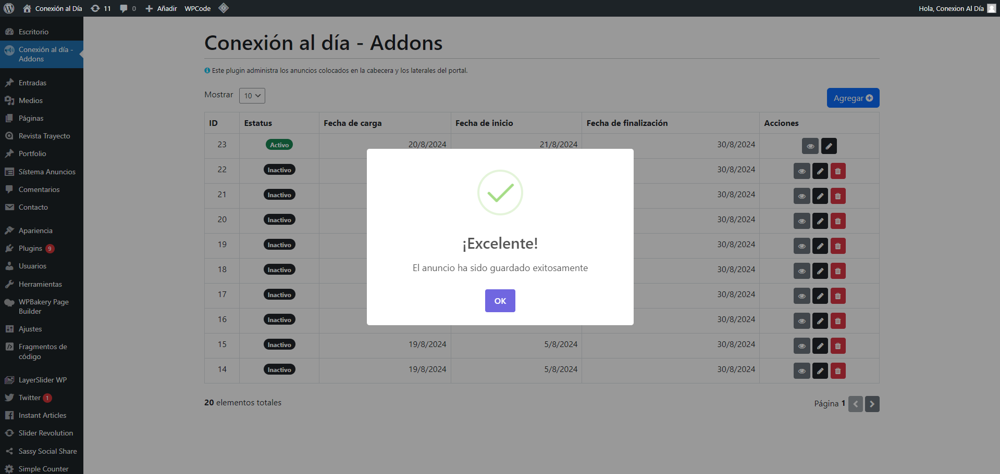
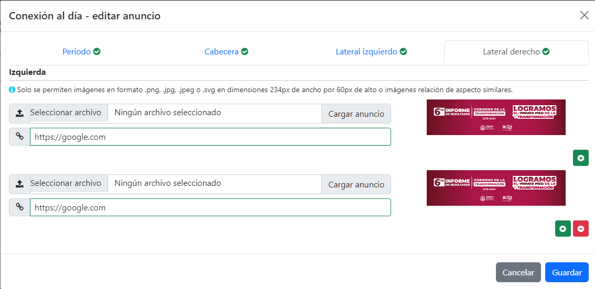
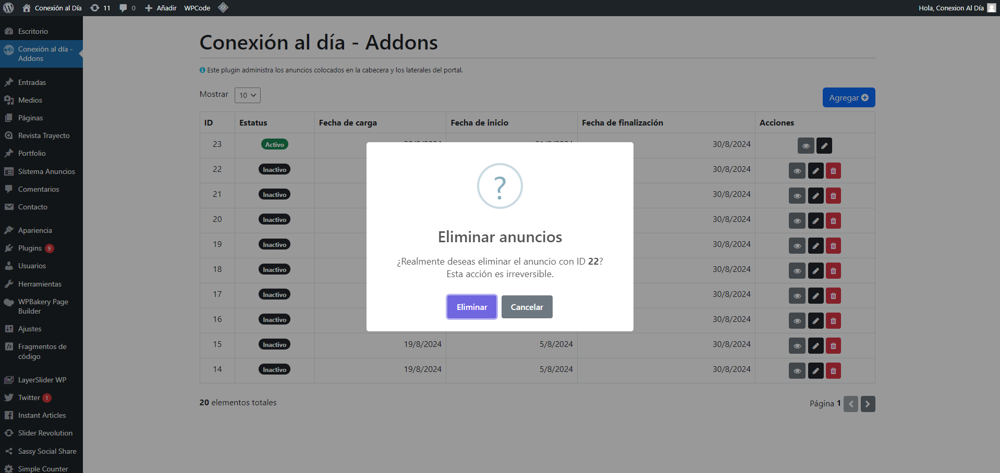
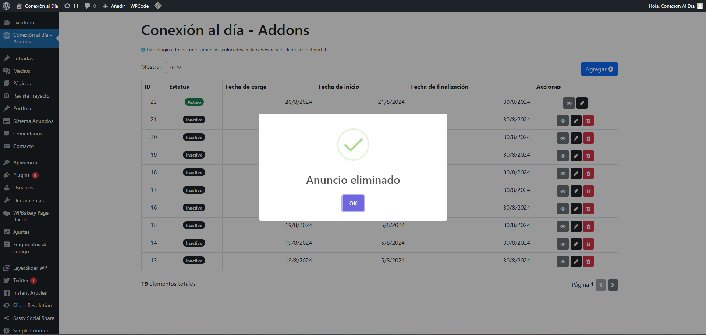
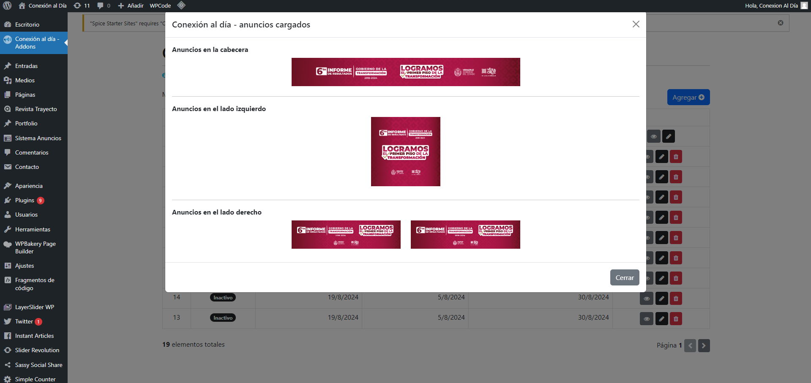

# Conexion al día - Addons

This is an adhoc plugin created to manage specific addons for the [https://conexionaldia.com](https://conexionaldia.com) WordPress website The website uses a custom theme and updating certain features is not allowed, making this plugun necessary to implement the required funcionality.

## Mínimun requirements
- PHP Version **7.4**+
- WordPress Version **6.6**+

## About this development
This plugin was developed under PSR-4 standart and using hexagonal architecture to manage a maintainable and scalable layer out of general WordPress plugin functions

## Installation
Download this project on **.zip** extension and upload it using WordPress Plugins Manager

## Demo images:

## User guide
[User guide](./docs/userguide.pdf)

## Author
**Epsom Segura**

📨 Email: segurajaramilloepsom@gmail.com

🔗 LinkedIn: https://www.linkedin.com/in/epsomsegura/
